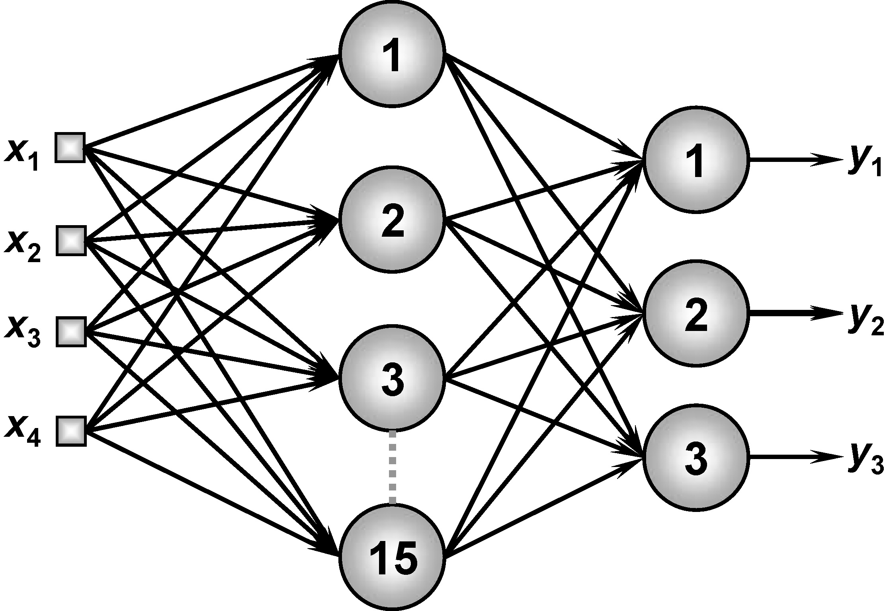

<h1>MLPClassificacaoPadrao</h1>

Implementação da Rede Neural Perceptron Multiplascamadas (PMC, ou MLP do inglês Multilayer Perceptron) proposta no Projeto prático 5.9 do livro "Redes Neurais Arficiais para engenharia e ciências aplicadas" do autor Ivan Nunes da Silva.

<h4>
Aluno: Jônatas Trabuco Belotti 
Email: jonatas.t.belotti@hotmail.com
</h4>

<h2>Arquitetura da rede</h2>

A rede possui quatro sinais de entrada, uma camada escondida com quinze neurônios e uma camada de saída com três neurônios. Conforme a imagem a seguir.

<h2>Arquivos</h2>

Os arquivos do repositórios são:

<b>Pasta "Dados" - </b> Contém um arquivo de exemplo para conjunto de treinamento da rede "Dados treinamento.txt" e um arquivo de exemplo para o conjunto de teste "Dados teste.txt".

<b>Pasta "MLPClassificaoPadrao" - </b> Contém o projeto do NetBeans com a implementação da rede Perceptron Multiplascamadas em Java.

<b>Arquivo "MLPClassificaoPadrao.exe" - </b> Arquivo executavel da rede para ser executado em Windows.

<b>Arquivo "MLPClassificaoPadrao.jar" - </b> JAR da rede para ser executado em linux ou Windows.

<b>Arquivo "Relatorio.pdf" - </b> Arquivo PDF contendo o relatório entregue para a diciplina.

<b>Atenção - </b> para executar os arquivos "MLPClassificaoPadrao.jar" ou "MLPClassificaoPadrao.exe" é necessário ter o <a target="_blank" href="https://www.java.com/pt_BR/download/">Java JRE</a> ou <a target="_blank" href="http://www.oracle.com/technetwork/pt/java/javase/downloads/index.html">Java JDK</a> instalado em seu computador.
